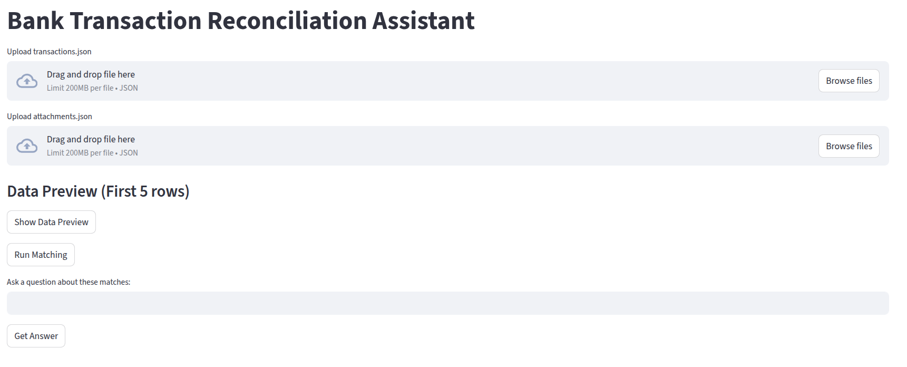
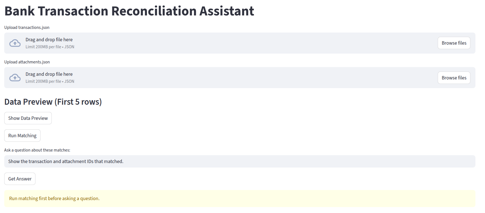
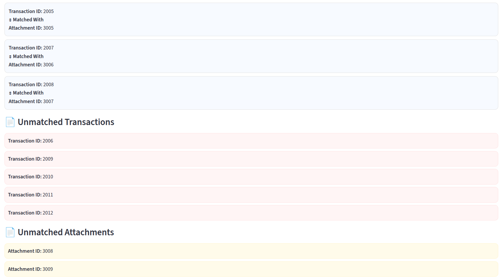
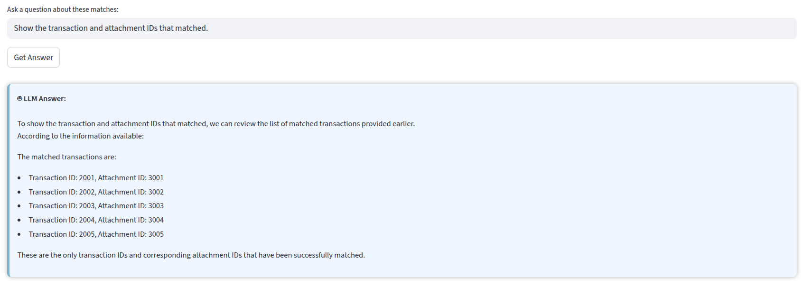
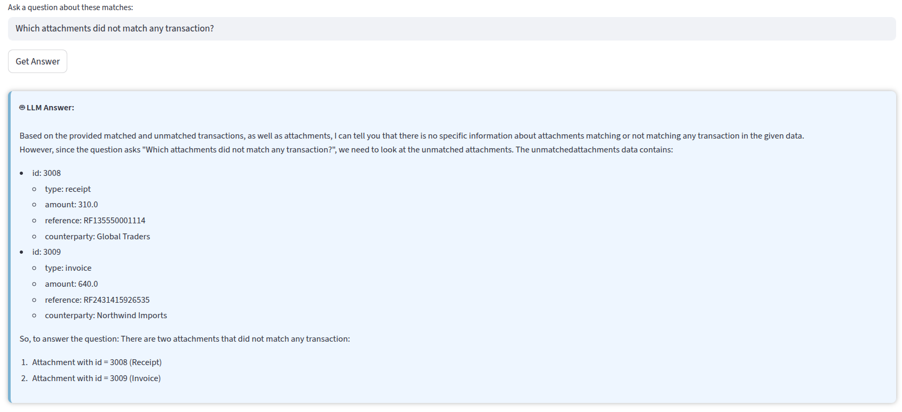
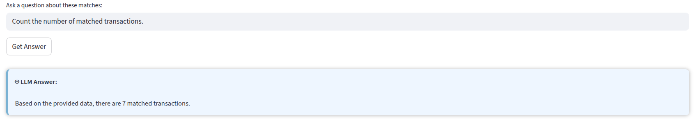
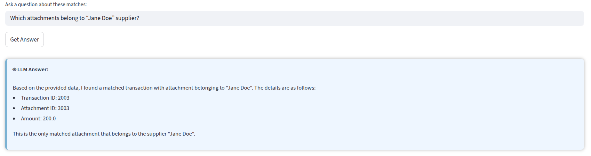

# Bank Transaction Reconciliation Assistant
This project implements a heuristic-based system to match financial transactions with their corresponding attachments (invoices or receipts). The matching logic uses reference numbers, amounts, counterparty names, and date proximity to identify the most likely matches.

---
# Table of Contents

1. [Project Overview](#bank-transaction-reconciliation-assistant)
2. [Features](#features)
3. [Architecture & Technical Decisions](#architecture--technical-decisions)
   1. [Data Representation](#data-representation)
   2. [Normalization & Comparison](#normalization--comparison)
   3. [Heuristic Scoring](#heuristic-scoring)
   4. [Duplicate Handling](#duplicate-handling)
   5. [Matching Flow](#matching-flow)
4. [Project Structure](#project-structure)
5. [Installation & Running](#how-to-run-program)
6. [Functions Overview](#functions-overview)
7. [Notes](#notes)
8. [Additional Work: LLM-Based Interface](#additional-work-llm-based-interface)

---
## Features
- Normalize reference numbers to ensure consistent matching.
- Compare transaction and attachment amounts for exact matches.
- Match counterparty names using case-insensitive substring checks.
- Consider date proximity (within 7 days) between transaction and attachment dates.
- Prevent duplicate matches using used IDs tracking.
- Heuristic scoring system to rank potential matches.

---
## Architecture & Technical Decisions
1. **Data Representation**
   - Transactions and attachments are represented as dictionaries (`Transaction` and `Attachment`) to allow flexible access to arbitrary fields.
   
2. **Normalization & Comparison**
   - Reference numbers are normalized by removing spaces, `RF` prefix, and leading zeros.
   - Names are compared using a substring check, case-insensitive.
   - Dates are parsed into Python `datetime` objects to enable difference calculation.

3. **Heuristic Scoring**
   - **Amount match:** +3 points if transaction and attachment amounts match exactly.
   - **Counterparty match:** +2 points if names are similar.
   - **Date proximity:** +1 point if the transaction date is within 7 days of the attachment’s invoice or due date.
   - Only matches with total score ≥ 4 are considered confident.

4. **Duplicate Handling**
   - Each matched transaction or attachment is tracked using `used_transaction_ids` and `used_attachment_ids` to avoid multiple assignments.

5. **Matching Flow**
   - **Step 1:** Attempt perfect reference match.
   - **Step 2:** If no perfect match, then compute heuristic scores and select the highest.
   - **Step 3:** Skip items already matched using the used IDs sets.

---

## Project Structure
```plaintext
project-root/
├─ src/
│  ├─ data/ # Fixture data for transactions and attachments
│  │  ├─ attachments.json
│  │  └─ transactions.json
│  ├─ match.py # Core matching logic and scoring functions
│  └─ llm_inference_app.py # Streamlit + local LLM interface
├─ images/ # Screenshots of Streamlit interface interactions
│  ├─ 1_bank_transaction_reconciliation_chatbot.png
│  ├─ 2_warning_to_run_matching_first.png
│  ├─ 3_filterout_matched_data_with_unmatched_transactions_attachments.png
│  ├─ 4_list_matched_data.png
│  ├─ 5_list_unmatched_transactions.png
│  ├─ 6_count_matched_transactions.png
│  └─ 7_attachments_with_supplier_names.png
├─ run.py # Script to run the matching and display results
├─ README.md
├─ requirements.txt
└─ venv/ # Python virtual environment

```
---

## How to Run Program

1. Clone the repository:

```bash
git clone https://github.com/khizraghaffarkk/financial-reconciliation-engine.git
cd financial-reconciliation-engine
```

2. Ensure you have Python 3.9+ installed.
3. Run the main program:
```bash
python3 run.py
```
4. The program will output a report of transactions and their matched attachments, including success (✅) or failure (❌) indicators.

## Functions Overview
### Heuristic Matching Functions
- `normalize_reference(reference)` – Standardizes reference numbers.
- `parse_date(date_str)` – Converts string dates to `datetime` objects.
- `similar_name(transaction_contact, attachment_party)` – Checks if names are similar.
- `get_counterparty(attachment)` – Extracts the counterparty name from an attachment.
- `get_attachment_amount(attachment)` – Retrieves the total amount from an attachment.
- `compute_match_score(transaction, attachment)` – Computes heuristic match score.
- `find_attachment(transaction, attachments)` – Finds the best matching attachment for a transaction.
- `find_transaction(attachment, transactions)` – Finds the best matching transaction for an attachment.
### LLM-Based Functions
- `run_matching(transactions, attachments)` – Performs full matching, displays matched/unmatched results, and allows interactive user queries to a local LLM.
- `llm_chatbot(matched, unmatched_tx, unmatched_att, question)` – Sends a user question along with matched/unmatched transactions and attachments to a local LLM (Llama 3.2) and returns an answer strictly based on the provided context.
---

## Notes

- The scoring thresholds and heuristic weights were chosen to balance accuracy and avoid false positives.
- The system is modular, so future improvements can replace or augment the scoring function with more advanced matching algorithms (e.g., token-based matching, ML-based similarity).

## Additional Work: LLM-Based Interface

This project also includes a **Streamlit interface** integrated with a **local LLM (Llama 3.2)** to assist with transaction reconciliation interactively, which demonstrates how AI workflows can enhance accounting automation.

### Features
- Upload transactions and attachments JSON files or use default sample data.
- Display a **data preview on demand** (first 5 rows).
- Run matching using existing heuristic functions (`find_attachment` and `find_transaction`).
- Display **matched pairs**, **unmatched transactions**, and **unmatched attachments** with visually appealing cards.
- Ask questions about the reconciliation, answered by the **local LLM**, strictly based on provided data.

### Implementation

- **Local LLM Integration:** Uses OpenAI API compatible interface pointing to local Llama 3.2 server.
- **Data Preparation for LLM:** Simplified JSON containing:
  - Matched transactions & attachments
  - Unmatched transactions
  - Unmatched attachments
  - Question asked by user
- **Interface Styling:** Streamlit uses HTML/CSS cards for clear, attractive display of matches and LLM answers.

### Requirements to Run Streamlit Interface
**Note:** It is advisable to create a Python virtual environment to avoid dependency conflicts.

1. Create and activate a virtual environment (optional but recommended):
```bash
python -m venv venv
source venv/bin/activate   # On Linux/macOS
venv\Scripts\activate      # On Windows
```
2. Install the required dependencies listed in `requirements.txt`:

```bash
pip install -r requirements.txt
```
3. Download and run the Ollama server.
4. Pull any LLM model of your choice, and update its name inside the llm_chatbot function. The default model used is llama3.2:latest.
5. Run the Streamlit interface:
```bash
streamlit run src/llm_interface.py
```

### Optional (Simpler way using bash script)

You can also run everything using the provided bash script `chatbot_setup_and_run.sh`, which handles dependency installation, Ollama setup, pulling the default model, and launching Streamlit.

- Make the script executable (Linux/macOS):**
```bash
chmod +x chatbot_setup_and_run.sh
```
- Run the script:
```bash
./chatbot_setup_and_run.sh
```
- You can also run it directly without changing permissions using:
```bash
bash chatbot_setup_and_run.sh
```
This approach automates all setup steps and launches the chatbot interface for you.

### Example Questions Users Can Ask

- Show the transaction and attachment IDs that matched.
- Which attachments did not match any transaction?
- Count the number of matched transactions.
- Which attachments belong to “Jane Doe” supplier?

### Screenshots: How to Interact with the Interface

#### 1. Initial Chatbot Interface

#### 2. Warning: Run Matching First

#### 3. Filtered View: Matched Data with Unmatched Transactions & Attachments

#### 4. Display Matched Transactions and Attachments

#### 5. Display Unmatched Transactions

#### 6. Count of Matched Transactions

#### 7. Attachments for Specific Supplier (Jane Doe)

  

### Limitations of the LLM Interface

- **Small model size:** The LLM is lightweight and has limited capacity to reason across large datasets.
- **Limited context:** To reduce hallucinations, advanced techniques like embeddings or larger models would be needed. Currently, answers may sometimes be partially correct or inconsistent.
- **Static data only:** The interface handles the provided dataset, but could be extended with AI agents to interact with **real-time financial data** in the future.
